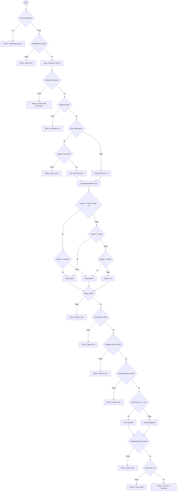
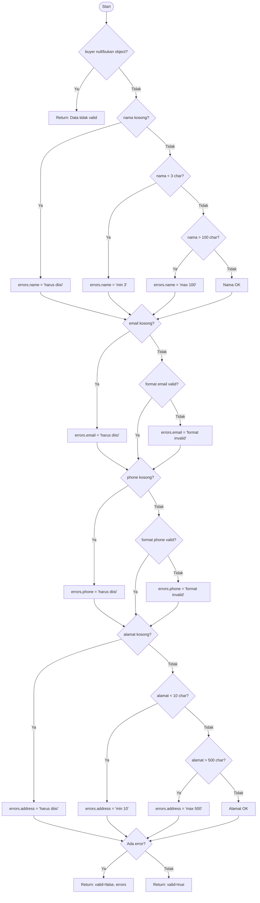
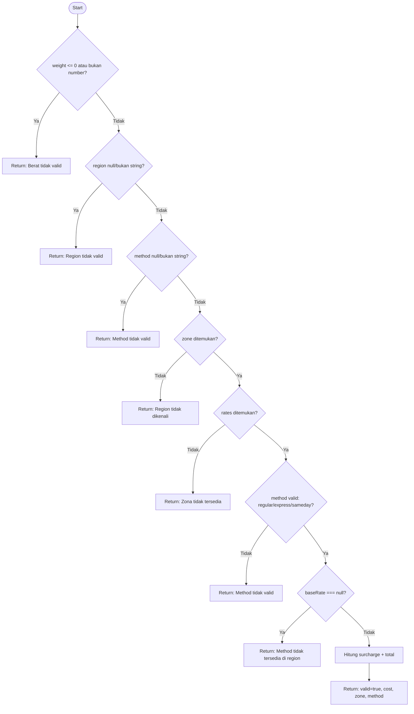
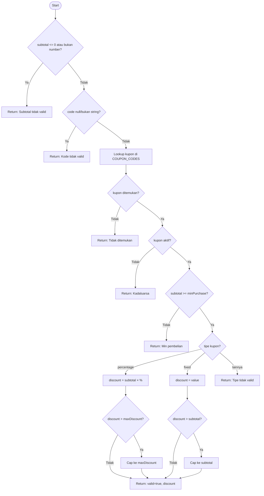

# 📐 Analisis Cyclomatic Complexity & Flow Graph

## TechMart E-Commerce Checkout - Module `checkout.js`

---

## 1. Tabel Cyclomatic Complexity

Rumus: **V(G) = E - N + 2P** atau disederhanakan **V(G) = jumlah_decision_points + 1**

| No | Fungsi | Decision Points | V(G) | Risiko |
|----|--------|----------------|------|--------|
| 1 | `validateProductData` | 7 (null, id, name, price, stock, weight, category) | **8** | Simple ✅ |
| 2 | `calculateItemSubtotal` | 6 (price type, qty type, price≤0, qty≤0, integer, max) | **7** | Simple ✅ |
| 3 | `validateStock` | 5 (null/array, empty, not found, >stock, ≤0) | **6** | Simple ✅ |
| 4 | `applyCoupon` | 9 (subtotal, code, not found, inactive, minPurchase, percentage, maxCap, fixed, fixedCap) | **10** | Moderate ⚠️ |
| 5 | `calculateBundleDiscount` | 4 (null/empty, subtotal, ≥threshold, <threshold) | **5** | Simple ✅ |
| 6 | `calculateTax` | 4 (amount, region, unknown, zero) | **5** | Simple ✅ |
| 7 | `calculateWeightSurcharge` | 5 (negative, ≤1, ≤3, ≤5, ≤10) | **6** | Simple ✅ |
| 8 | `calculateShipping` | 7 (weight, region, method, zone, rates, methodName, null rate) | **8** | Simple ✅ |
| 9 | `validateBuyerData` | 11 (null, name empty/min/max, email empty/format, phone empty/format, address empty/min/max) | **12** | Moderate ⚠️ |
| 10 | `processCheckout` | 15 (cart, stock, product loop, subtotal, coupon valid/error, bundle, discount compare ×3, region, tax, method, shipping, freeShip, buyer, grandTotal) | **16** | Moderate ⚠️ |

### Ringkasan

| Kategori | V(G) Range | Jumlah Fungsi | Daftar |
|----------|-----------|---------------|--------|
| 🟢 Simple | 1-10 | 7 | validateProductData, calculateItemSubtotal, validateStock, calculateBundleDiscount, calculateTax, calculateWeightSurcharge, calculateShipping |
| 🟡 Moderate | 11-20 | 3 | applyCoupon, validateBuyerData, processCheckout |
| 🔴 High | 21-50 | 0 | - |
| ⛔ Very High | >50 | 0 | - |

**Total Complexity: V(G) = 83** | **Rata-rata: 8.3 per fungsi**

---

## 2. Flow Graph - Fungsi Utama

### 2.1 Flow Graph: `processCheckout` (V(G) = 16)

### 2.2 Flow Graph: `validateBuyerData` (V(G) = 12)

### 2.3 Flow Graph: `calculateShipping` (V(G) = 8)

### 2.4 Flow Graph: `applyCoupon` (V(G) = 10)

---

## 3. Jalur Uji (Test Paths)

Berdasarkan Cyclomatic Complexity, jumlah minimum jalur uji yang diperlukan:

| Fungsi | V(G) | Min Test Paths | Actual Test Cases | Status |
|--------|------|---------------|-------------------|--------|
| validateProductData | 8 | 8 | 8 | ✅ Tercukupi |
| calculateItemSubtotal | 7 | 7 | 7 | ✅ Tercukupi |
| validateStock | 6 | 6 | 6 | ✅ Tercukupi |
| applyCoupon | 10 | 10 | 12 | ✅ Melebihi |
| calculateBundleDiscount | 5 | 5 | 5 | ✅ Tercukupi |
| calculateTax | 5 | 5 | 6 | ✅ Melebihi |
| calculateWeightSurcharge | 6 | 6 | 6 | ✅ Tercukupi |
| calculateShipping | 8 | 8 | 12 | ✅ Melebihi |
| validateBuyerData | 12 | 12 | 12 | ✅ Tercukupi |
| processCheckout | 16 | 16 | 16 | ✅ Tercukupi |
| **TOTAL** | **83** | **83** | **90** | ✅ |

> Seluruh jalur logika telah diuji dengan jumlah test case melebihi minimum Cyclomatic Complexity.
